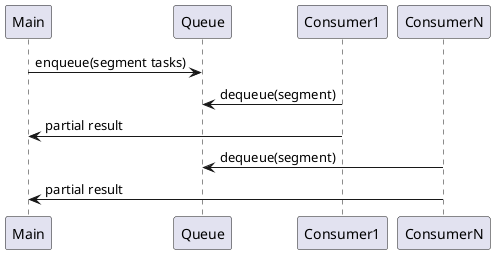
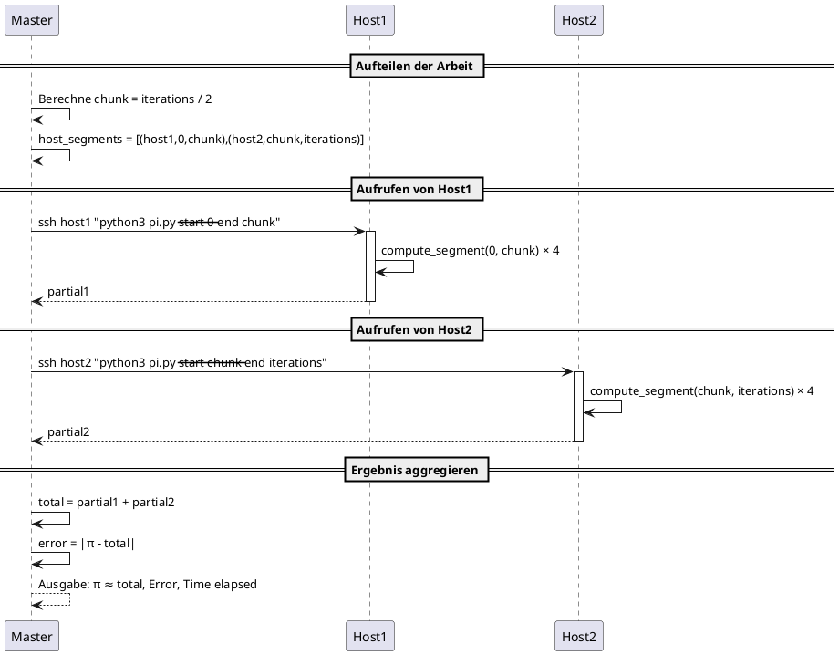

# ParallelPi

School project for parallel and distributed systems.

## Overview

`ParallelPi` is a Python program to approximate π using the Leibniz series, implemented with multiple parallel and distributed computation strategies. It includes:

* **GIL-bound threading** (mode: `--with-gil`)
* **Producer–Consumer threading** (mode: `--with-thread`)
* **Producer–Consumer multiprocessing** (mode: `--with-process`)
* **Multiprocessing pool** (mode: `--pool`)
* **Distributed computation via SSH** (mode: `--hosts`)
* **Sequential fallback** using `map`/`filter`/`reduce`
* **Timing & error reporting**

## Requirements

* Python 3.6+
* `argparse`, `threading`, `multiprocessing`, `queue`, `subprocess`, `time`, `math`, `functools`, `operator`, `os`
* SSH access and Python installed on remote hosts (for distributed mode)

## Usage

Clone the repository and run `pi.py` with the desired mode:

```bash
# Sequential computation (map/filter/reduce)
python pi.py -i 1000000

# GIL-bound threads (4 threads)
python pi.py -i 1000000 --with-gil -t 4

# Producer–Consumer threads (8 threads)
python pi.py -i 1000000 --with-thread -t 8

# Producer–Consumer processes (4 processes)
python pi.py -i 1000000 --with-process -p 4

# Multiprocessing pool (8 workers)
python pi.py -i 1000000 --pool 8
```

## Arguments

| Flag                 | Description                                                           |
| -------------------- | --------------------------------------------------------------------- |
| `-i`, `--iterations` | Number of series terms to sum                                         |
| `-t`, `--threads`    | Number of threads (for threading modes)                               |
| `-p`, `--processes`  | Number of processes (for process modes)                               |
| `--with-gil`         | Use GIL-bound threading                                               |
| `--with-thread`      | Use producer–consumer threading                                       |
| `--with-process`     | Use producer–consumer multiprocessing                                 |
| `--pool`             | Use multiprocessing pool (specify number of workers)                  |
| `--hosts`            | Comma-separated list of remote hosts (requires `-s` and `--seg-size`) |
| `-s`, `--segments`   | Number of segments for manual or distributed mode                     |
| `--seg-size`         | Size of each segment (for manual or distributed mode)                 |

## Architecture

The project follows a modular design. Below is a simplified PlantUML diagram of the producer–consumer architecture:



Here are some thoughts for the calculation with multiple hosts



## Evaluation-Grid
| Features                                                    | Punkte | Erfüllt | Geschätzte Punkte | Comment |
|-------------------------------------------------------------|:------:|:-------:|:-----------------:|:-------:|
| calc pi with k GIL threads                                  |  3.5   |  Ja     |  3.5              |         |
| calc pi with k parallel (non-GIL) threads                   |  0.2   |  Ja     |  0.2              |         |
| calc pi with k processes                                    |  0.2   |  Ja     |  0.2              |         |
| producer/consumer architecture                              |  0.5   |  Ja     |  0.5              |         |
| producer/consumer architecture mit map/filter/reduce        |  0.5   |  Ja     |  0.5              |         |
| using a thread pool                                         |  0.2   |  Ja     |  0.2              |         |
| timing and error data                                       |  0.2   |  Ja     |  0.2              |Wird immer ausgegeben|
| calc pi with k processes on n hosts                         |  1.0   |Teilweise|  0.2              |Konnte nicht getestet getestet werden.|
| complete set of image/sketch for architecture               |  0.2   |  Ja     |  0.2              |Plantuml in README.md|
| Documentation API                                           |  0.2   |  Ja     |  0.2              |README.md|

## License

This project is licensed under the MIT License. Feel free to use and modify.
